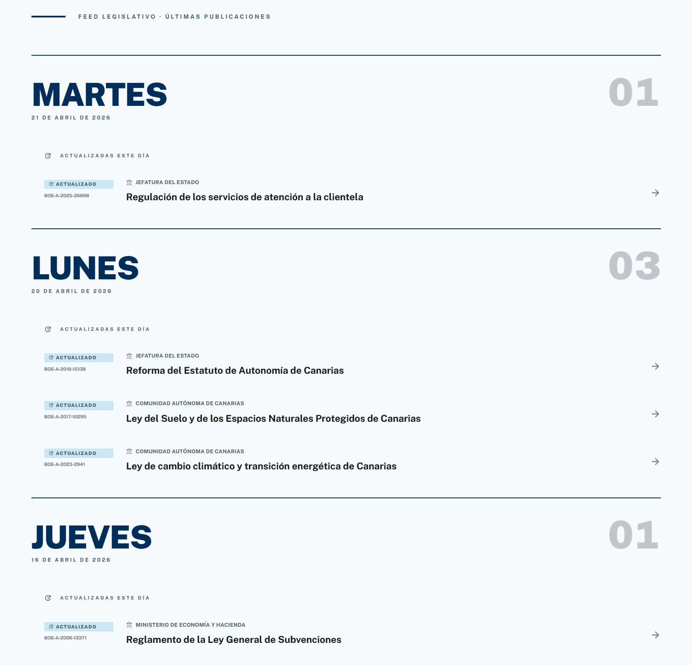

# Ágora — Resúmenes de legislación española

Repositorio actualizado de **resúmenes generados por inteligencia artificial** de las leyes publicadas en el Boletín Oficial del Estado (BOE) en España, cubriendo tanto la legislación estatal como la de las comunidades autónomas.

El proyecto es **gratuito y sin ánimo de lucro**. Su único objetivo es acercar la actividad legislativa a los ciudadanos, ofreciendo textos claros y accesibles que resumen lo que las leyes dicen y cómo pueden afectar a la vida cotidiana.

He creado una pequeña apliacación web para visualizar este repositorio aquí: 

[dsuarezv.github.io/agora-front](https://dsuarezv.github.io/agora-front/#/)

---

## Cobertura

Cada archivo corresponde a una disposición legal y contiene un resumen en lenguaje claro pensado para el ciudadano, no para el jurista. Por cada ley hay varios ficheros:

* `summaries/` contiene ficheros JSON por cada ley con un breve resumen de la ley, impacto para el ciudadano y empresas, obligaciones, puntos clave y guía de procedimentos en formato estructurado. 
* `articles/` contiene ficheros markdown con un resumen en formato artículo periodístico destacando los aspectos más relevantes de la ley en un tono cercano y que busca cubrir los puntos más relevantes para la ciudadanía. 
  * Puede contener también un resumen adicional de todos los cambios que ha tenido la ley desde su introducción. 

Los resúmenes están organizados por ámbito territorial:

| Código | Territorio |
|--------|-----------|
| `es` | Legislación estatal (BOE) |
| `es-an` | Andalucía |
| `es-ar` | Aragón |
| `es-as` | Asturias |
| `es-cb` | Cantabria |
| `es-cl` | Castilla y León |
| `es-cm` | Castilla-La Mancha |
| `es-cn` | Canarias |
| `es-ct` | Cataluña |
| `es-ex` | Extremadura |
| `es-ga` | Galicia |
| `es-ib` | Islas Baleares |
| `es-mc` | Región de Murcia |
| `es-md` | Comunidad de Madrid |
| `es-nc` | Navarra |
| `es-pv` | País Vasco |
| `es-ri` | La Rioja |
| `es-vc` | Comunitat Valenciana |

## Licencia

Este repositorio se distribuye bajo los términos de la licencia incluida en [LICENSE](LICENSE).

Los textos fuente son publicaciones oficiales del Estado español y están sujetos a su propia normativa de reutilización.

---

*Proyecto independiente. No tiene vinculación con ninguna administración pública, partido político ni entidad comercial.*
